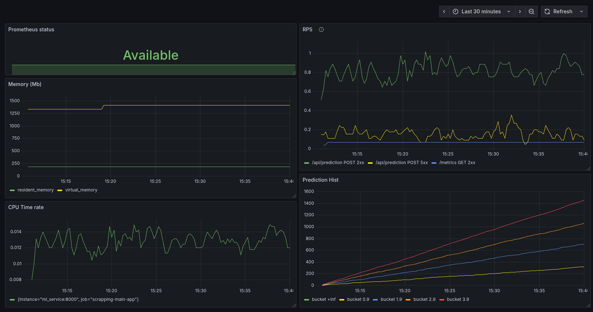

# Классификация мобильных устройств

Проект направлен на разработку модели классификации, которая по характеристикам мобильного устройства предсказывает его ценовой диапазон (price_range). Исходные данные взяты из открытого датасета на Kaggle: [Mobile Price Classification](https://www.kaggle.com/datasets/iabhishekofficial/mobile-price-classification/code).

На основе обученной модели будет построен сервис предсказаний, в котором реализован сбор метрик с помощью Prometheus и мониторинг при помощи Grafana. Вся инфраструктура сервиса будет работать в контейнерах для удобства развертывания и масштабирования.

## Содержание

- [Технологии](#технологии)
- [Использование](#использование)
- [Исследование данных](#исследование-данных)
- [Запуск mlflow](#запуск-mlflow)
- [Результаты исследования](#результаты-исследования)
- [Создание сервиса](#создание-сервиса)
- [Мониторинг](#мониторинг)

## Технологии

- [Python](https://www.python.org)
- [FastAPI](https://fastapi.tiangolo.com)
- [MLflow](https://mlflow.org)
- [Docker](https://www.docker.com/)
- [Prometheus](https://prometheus.io)
- [Grafana](https://grafana.com)

## Использование

Для запуска проекта под ОС GNU/Linux необходимо выполнить команды:

```shell
git clone https://github.com/PodlubnyAY/mobile-price-classification.git
cd mobile-price-classification
python -m venv .venv
source .venv/bin/activate
python -m pip install -r requirements.txt
```

Для активации виртуального окружения используется команда:

```shell
source .venv/bin/activate
```

Для деактивации:

```shell
deactivate
```

## Исследование данных

В ходе исследования были проведены действия:

- Удалены записи с неположительным значением ёмкости аккумулятора, памяти, толщины телефона
- Удалены записи с горизонтальным разрешением большим вертикального
- Были удалены столбцы ``clock_speed``, ``fc``, ``int_memory``, ``m_deep``, ``n_cores``, ``sc_h``, ``sc_w``, ``talk_time``
- Номинальные признаки `blue`, `wifi`, `dual_sim`, `three_g` `four_g`, `touch_screen` были приведены из `int64` к `int8`

В ходе анализа были выявлены следующие закономерности:

- Данные распределены неравномерно, сильно выделяются `battery_power`, `px_height`, `px_width`, `ram`. Эти признаки имеют гораздо больший разброс значений. (см. [график](./eda/numeric_features_boxplot.png))
- Признаки `fc`, `px_height` имеют выбросы (значения, превышающие 1.5 IQR, где IQR - межквартильное расстояние, т.е. разность между значениями квартиля 3 и квартиля 1) (см. [график](./eda/numeric_features_boxplot.png))

- Наибольшую корреляцию с ценовой категорией имеют `RAM` (0.917), `battery_power` (0.199), `px_width` (0.166) и `px_height` (0.146) (см. [график](./eda/correlation_thresholded.png))
- Наибольшее влияние на цену телефона имеет объем оперативной памяти и разрешение экрана (см. [график](./eda/correlation.png))

- Малое число телефонов из выборки имеют хорошую фронтальную камеру (см. [график](./eda/features_dist.png))
- С увеличением `px_width` увеличивается количество экземпляров из категории 3. (см. [график](./eda/features_dist.png))
- Все номинальные признаки распределены равномерно по ценовым категориям (см. [график](/eda/features_dist.png) )

- на основе [графика](./eda/features_dist.png) составили среднего представителя флагмана (с наличием всех номинальных признаков) с ценовой категорией 3:
  - высокий `battery_power`
  - низкий `fc`
  - высокий `pc`
  - `px_height` от 250 до 750
  - `ram` более 3000
  - `px_width` от 1000 до 2000

- низкофункциональные модели (отсутствие все номинальных признаков) не выделяются относительно ценовых категорий (см. [график](./eda/underline_dist.png))

- Обработанная выборка сохранена в файл ./data/clean_data.pkl

[Подробнее](./eda/eda.ipynb)

## Запуск MLflow

Для запуска сервера необходимо перейти в директорию `mlflow` и выполнить bash-скрипт `start_mlflow.sh`

```shell
cd mlflow && $SHELL start_mlflow.sh
```

## Результаты исследования

Лучший результат показала модель `10 selected features`
со значением целевой метрики `f1-score` = 0.86

После подброда параметров удалось улучшить точность до 0.90
с параметрами: \
`n_estimators`: 74, `max_depth`: 22, `max_features`: 0.797

run_id = `4d4beea10f1349d2b37e66eaf065dfa7`

## Создание сервиса

### FastAPI

• Обработка запросов на `/` возвращает ответ `{'Hello': 'world'}`
• Обработка запросов на `/api/prediction` принимает идентификатор объекта и его признаки, использует модель для предсказания и возвращает price_range
• При создании экземпляра класса загружает модель из файла `model.pkl`
• Логирует результат загрузки модели.
• Метод `predict` принимает `dict` с признаками объекта, преобразует его в `pandas.DataFrame`, подает на вход модели и возвращает предсказание.

### Контейнеризация

Создание образа:

```bash
   docker build . --tag <imange_name>:<image_version>
```

> <imange_name> - произваольное название образа\
> <image_version> - версия образа\
> Команда запускается в директории, где находится Dockerfile

Запуск контейнера:

```bash
   docker run --rm -p 8001:8000 -v $(pwd)/../models:/models <imange_name>:<image_version>
```

> <imange_name>:<image_version> те же, что и при создании образа.

### Проверка роботоспособности сервиса

Подставим в тело запроса одну строку из датафрейма в виде JSON-объекта:

```json
 {
    "battery_power": 1434,
    "blue": 0,
    "clock_speed": 1.4,
    "dual_sim": 0,
    "fc": 11,
    "four_g": 1,
    "int_memory": 49,
    "m_dep": 0.5,
    "mobile_wt": 108,
    "n_cores": 6,
    "pc": 18,
    "px_height": 749,
    "px_width": 810,
    "ram": 1773,
    "sc_h": 15,
    "sc_w": 8,
    "talk_time": 7,
    "three_g": 1,
    "touch_screen": 0,
    "wifi": 1
}
```

Сервис возвращает значение price_range от 0 до 3. Пример ответа:

```json
{
  "price_range": "1",
  "flat_id": 0
}
```

## Мониторинг

Настроен сбор метрик работы модели, сервиса и инфраструктуры с помощью Prometheus, визуализация собранных метрик отображена на дашборде Grafana.



### Инфраструктурный уровень

#### CPU Time rate

Мониторинг процессорного времени, занимаемого сервисом

Метрики: process_cpu_seconds_total

#### Memory

Мониторинг виртуальной и резидентной памяти, занимаемой сервисом

Метрики: process_resident_memory_bytes, process_virtual_memory_bytes

### Прикладной уровень

#### Prometheus status

Отображение связи Prometheus с сервисом: Available если сервис связан с Prometheus, иначе Unavailable

Метрики: up - статус соединения

#### RPS

частота HTTP-запросов с группировкой по эндпоинтам, типам запроса и статусам ответа

Метрики: Rate запросов к /api/prediction (POST) и /metrics (GET)

### Качество предсказаний

#### Prediction Hist

Распределение значений предсказаний по диапазонам

Метрики: process_resident_memory_bytes, process_virtual_memory_bytes
